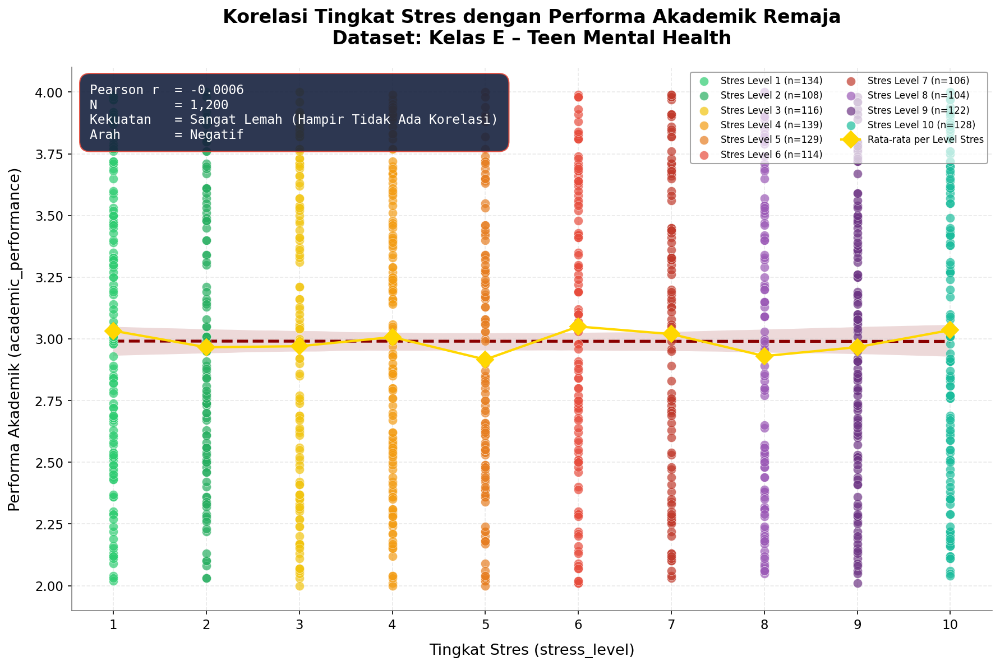
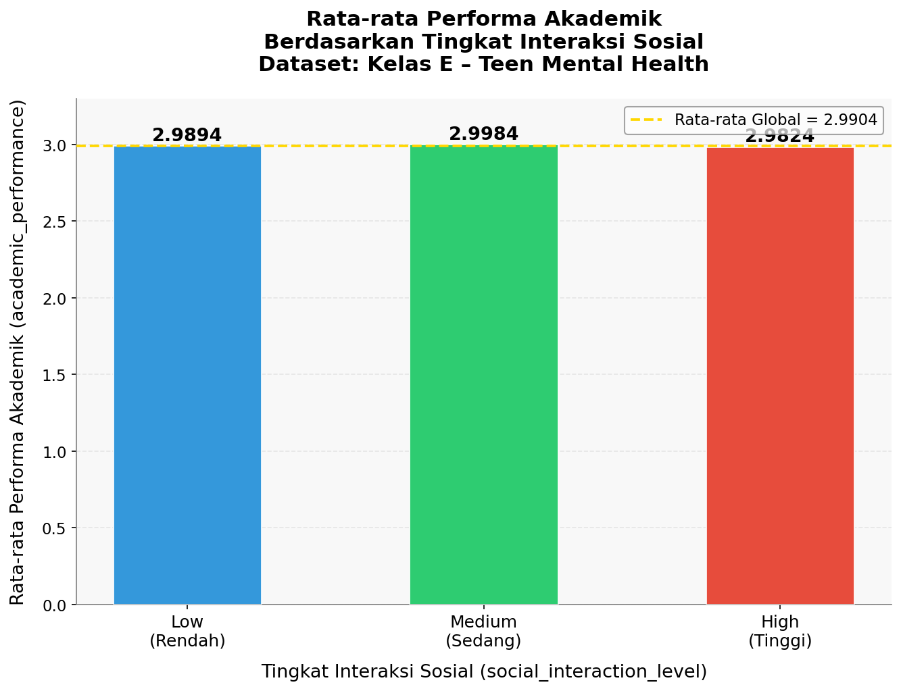
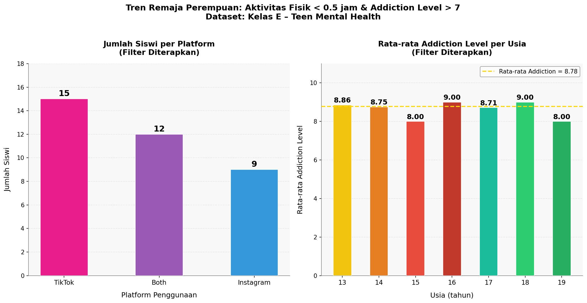
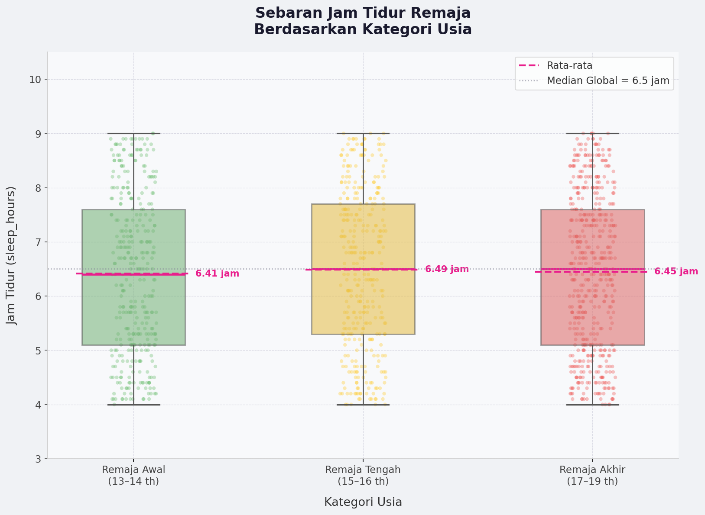
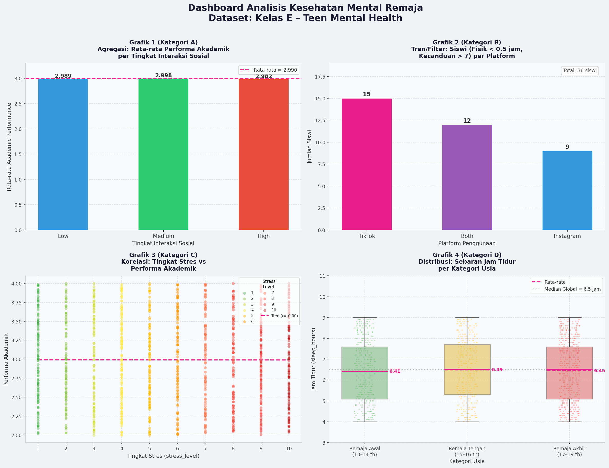

# 📊 Analisis dan Visualisasi Data Menggunakan Python


---

## 🎯 Deskripsi Proyek

Proyek ini merupakan implementasi analisis dan visualisasi data menggunakan bahasa pemrograman Python. Data diolah menggunakan beberapa pustaka analisis data dan divisualisasikan dalam berbagai bentuk grafik untuk memperoleh informasi yang lebih mudah dipahami.

Visualisasi yang dibuat meliputi:

* 📈 Scatter Plot
* 📊 Visualisasi Hasil Agregasi
* 🔍 Tren dan Filter Data
* 📉 Visualisasi Distribusi Data
* 🖼️ Dashboard Gabungan (Grid 2 × 2)
* 🎨 Infografis Laporan Akhir

---

# 👨‍💻 Anggota Kelompok

| Nama                               | NIM                | Tugas                                                      |
| ---------------------------------- | ------------------ | ---------------------------------------------------------- |
| **Jovan Arsenio Pasaribu**         | **21060125130072** | Visualisasi Scatter Plot dan Dashboard Gabungan (Grid 2×2) |
| **Dhio Rafid Al Akbar**            | **21060125130084** | Visualisasi Hasil Agregasi                                 |
| **Muhammad Iqbal Mahesa Suherman** | **21060125140139** | Analisis Tren dan Filter Data                              |
| **Rizki Abidilah Urahman D**       | **21060125140166** | Visualisasi Distribusi Data                                |

---

# 🛠️ Teknologi yang Digunakan

Proyek ini dikembangkan menggunakan beberapa library Python berikut:

```python
import pandas as pd
import numpy as np

import matplotlib.pyplot as plt
import seaborn as sns
```

### 📌 Fungsi Library

| Library    | Kegunaan                                 |
| ---------- | ---------------------------------------- |
| Pandas     | Pengolahan dan manipulasi data           |
| NumPy      | Operasi numerik dan komputasi matematis  |
| Matplotlib | Pembuatan grafik dasar                   |
| Seaborn    | Visualisasi statistik yang lebih menarik |

---

# 📂 Struktur Proyek

```text
PROJECT/
│
├── data/
│   └── dataset.xlsx
│
├── images/
│   ├── scatter_plot.png
│   ├── agregasi.png
│   ├── tren_filter.png
│   ├── distribusi.png
│   ├── dashboard_2x2.png
│   └── infografis.png
│
├── src/
│   ├── scatter_plot.py
│   ├── agregasi.py
│   ├── tren_filter.py
│   ├── distribusi.py
│   └── dashboard.py
│
└── README.md
```

---

# 📈 Hasil Visualisasi

## 1️⃣ Scatter Plot

**Penanggung Jawab:** Jovan Arsenio Pasaribu

📌 Tempatkan gambar hasil Scatter Plot pada lokasi berikut:

🖼️ HASIL:



---

## 2️⃣ Visualisasi Hasil Agregasi

**Penanggung Jawab:** Dhio Rafid Al Akbar

📌 Tempatkan gambar hasil agregasi:

🖼️ HASIL:



---

## 3️⃣ Analisis Tren dan Filter Data

**Penanggung Jawab:** Muhammad Iqbal Mahesa Suherman

📌 Tempatkan gambar hasil tren/filter:

🖼️ HASIL:



---

## 4️⃣ Visualisasi Distribusi Data

**Penanggung Jawab:** Rizki Abidilah Urahman D

📌 Tempatkan gambar hasil distribusi:

🖼️ HASIL:



# 🖼️ Dashboard Gabungan (Grid 2 × 2)

**Penanggung Jawab:** Jovan Arsenio Pasaribu

Visualisasi ini dibuat menggunakan:

```python
fig, axes = plt.subplots(2, 2, figsize=(15, 10))
```

Tujuan dari dashboard ini adalah menggabungkan seluruh visualisasi yang telah dibuat ke dalam satu tampilan sehingga memudahkan proses analisis dan interpretasi data.

📌 Tempatkan gambar dashboard:

🖼️ HASIL:



---

# ✨ Kontribusi Tim

| Anggota                        | Kontribusi                               |
| ------------------------------ | ---------------------------------------- |
| Jovan Arsenio Pasaribu         | Scatter Plot, Dashboard 2×2, Dokumentasi |
| Dhio Rafid Al Akbar            | Visualisasi Agregasi                     |
| Muhammad Iqbal Mahesa Suherman | Analisis Tren dan Filter                 |
| Rizki Abidilah Urahman D       | Visualisasi Distribusi                   |
| Seluruh Anggota                | Penyusunan Infografis dan Laporan Akhir  |

---

# 📌 Kesimpulan

Melalui proyek ini, data berhasil dianalisis dan divisualisasikan menggunakan berbagai teknik visualisasi sehingga pola, distribusi, tren, serta hubungan antar variabel dapat diamati dengan lebih mudah. Penggunaan Pandas, NumPy, Matplotlib, dan Seaborn membantu proses analisis menjadi lebih efisien serta menghasilkan visualisasi yang informatif.

---

## 🎉 Terima Kasih 🎉

⭐ Semoga proyek ini dapat menjadi referensi pembelajaran mengenai analisis dan visualisasi data menggunakan Python.

📊 📈 📉 🎨 🚀
